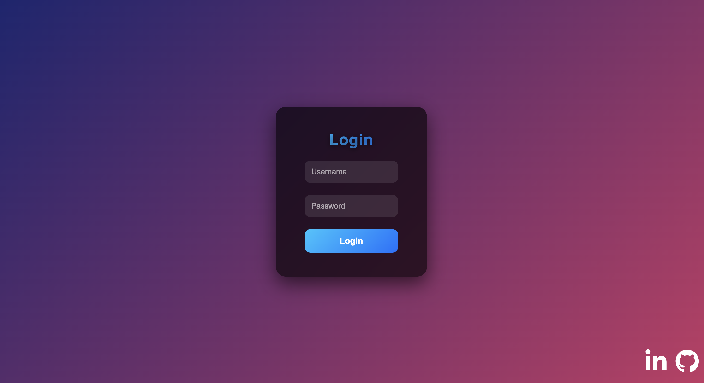

  
  
# websocket terminal
  access && control your server with websocket and filemanager
  

## requirements

  npm i express

  npm i ws

  npm i node-pty

## how to set password 

  "https://emn178.github.io/online-tools/sha256.html" 
  go that website and get hash values of your username password pair,
  and put them into userPassword.js 

## Run

  node server.js 
  default listens at port 3000