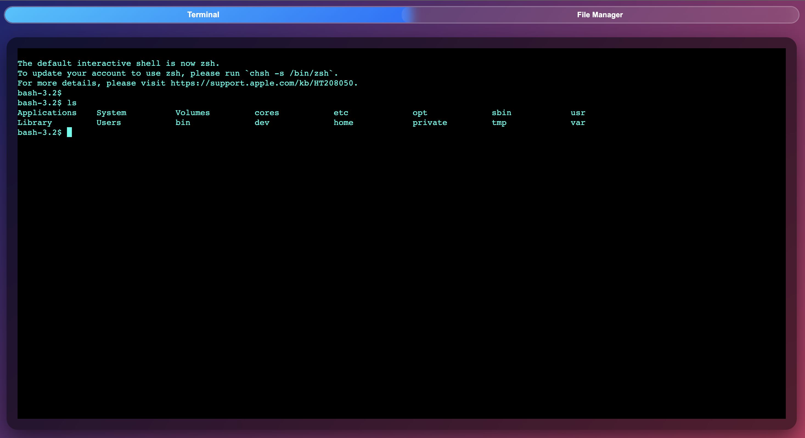
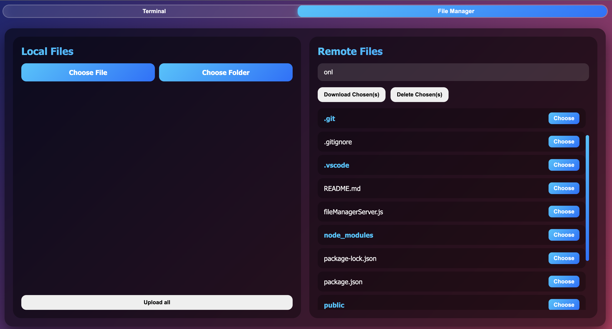

  
  
# websocket terminal
  access && control your server with websocket and filemanager

## Photos

  
  *login page*
  
  *terminal*
  
  *file manager*

## requirements

  npm i express

  npm i ws

  npm i node-pty

  npm i archiver 
  
  *archiver required because of downloading remote folders as zip*

## how to set password 

  "https://emn178.github.io/online-tools/sha256.html" 
  
  go that website and get hash values of your username password pair,
  and put them into userPassword.js 

## Run

  node server.js 
  
  default listens at port 3000
